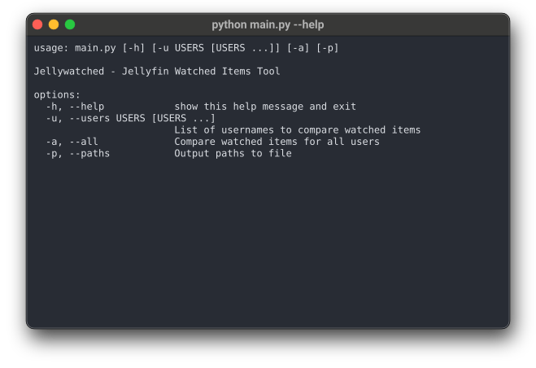
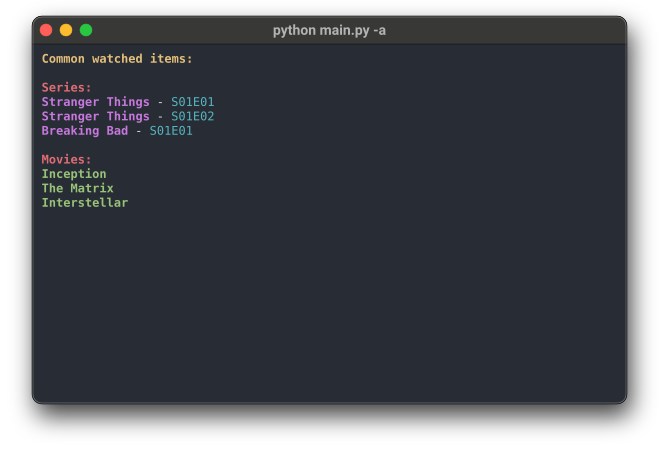

<h1 align='center'>
    
    <br>
    Jellywatched
    <br>
</h1>

<div align='center'>
    <a href='https://github.com/jbakalarski/Jellywatched'>
        
    </a>
    <a href='https://github.com/jbakalarski/Jellywatched/tags'>
        
    </a>
    <a href='https://github.com/jbakalarski/Jellywatched/issues'>
        
    </a>
    <a href='https://github.com/jbakalarski/Jellywatched/pulls'>
        
    </a>
</div>

<br>

**❓ What is this?** Jellywatched is a lightweight command-line tool for Jellyfin servers that lets you compare watched movies and episodes between users.

**❓ How to use it?**
* [**Using Python**](#-using-python-to-run-jellywatched)

**❓ What did I use?**
* [Python](https://www.python.org/)
* [Jellyfin API](https://api.jellyfin.org/)
* [Coding](https://code.visualstudio.com/)
* [Git management](https://desktop.github.com/)

## 🐍 Using Python to run Jellywatched
1) Install Python and Git
2) Clone this repository and enter its directory:
```bash
git clone https://github.com/jbakalarski/Jellywatched.git
```
3) Install requirements:
```bash
python -m pip install -r requirements.txt
```
4) Fill `.env` according to [.env instructions](#%EF%B8%8F-env-instructions)
5) Run main.py:
```bash
# Compare watched items for all users
python main.py --all

# Compare watched items for specific users
python main.py --users alice bob

# Also generate paths.txt file
python main.py --users alice bob --paths
```
6) It works!

## 🧩 Arguments
* `-u, --users` – specify one or more usernames to compare watched items
* `-a, --all` – compare watched items for all users
* `-p, --paths` – generate a file containing the media paths


## 🛠️ Environment variables
* `JELLYFIN_URL` – the URL of your Jellyfin server
* `API_KEY` – an API key generated in Jellyfin's dashboard under **API Keys**
* `MEDIA_PATH` – the path to the folder containing your Jellyfin libraries (e.g. `/home/ubuntu/jellyfin/media`)
* `PATHS_FILE` – the name of the paths file (e.g. `paths.txt`)

## 🚀 Features
* 🎬 Compare watched movies and episodes between multiple users
* 👥 Automatically fetch all Jellyfin users or select specific ones
* 📺 Supports both movies and TV episodes
* 🔎 Finds only items watched by all selected users
* ⚡ Fast, simple, no database required
* 🖥️ Clean, colored CLI output
* 🔐 Uses Jellyfin API key (no login required)

## 🖥️ Screenshot


## ❓ Purpose
Jellywatched helps you discover what everyone has already watched on your Jellyfin server — perfect for choosing something to remove to free some space.

## 💲 Support
<p><a href="https://support.jedrzej.me/" target="_blank"> </a></p>